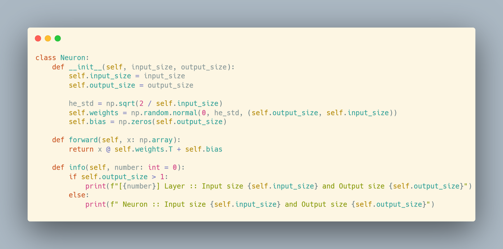
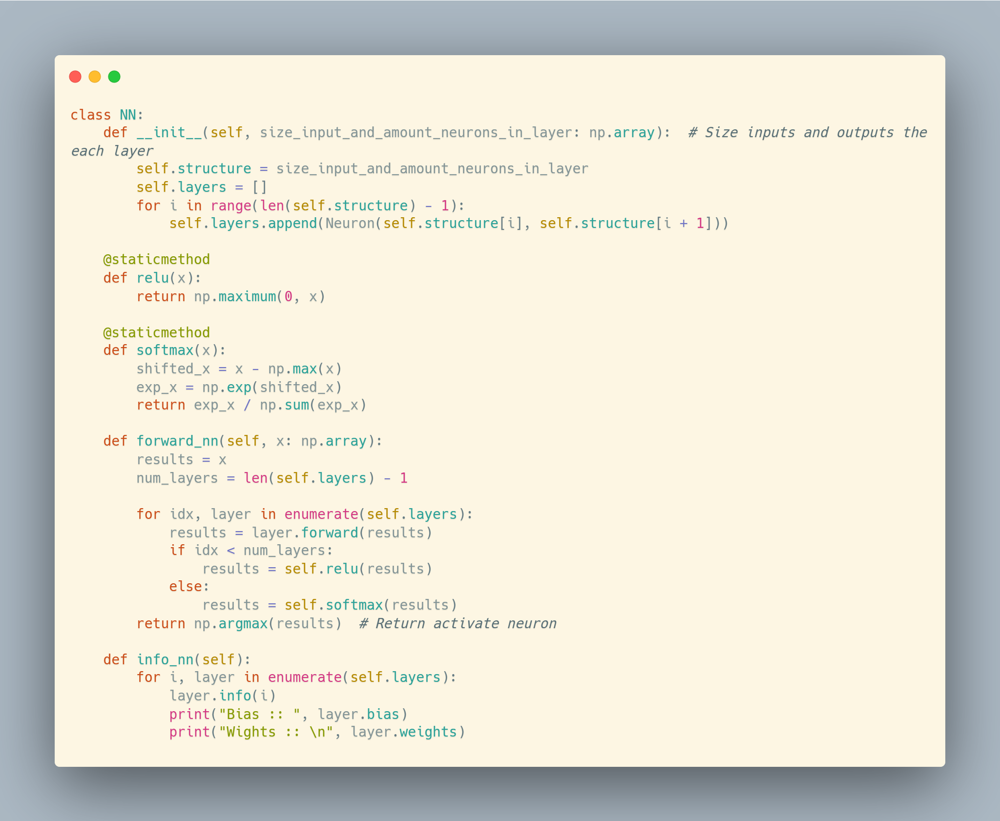
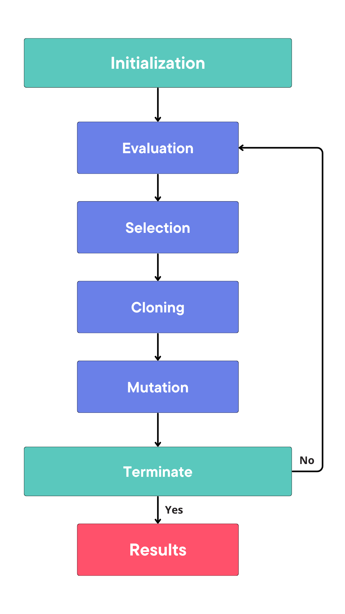
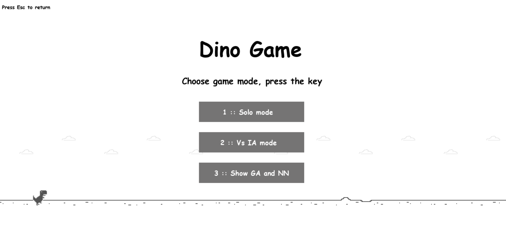

<h1 align="center" style="font-weight: bold;">Construction and Optimization of a Neural Network using a Genetic Algorithm for the Dinosaur Game


[](https://github.com/Rafaelsoz/AI-Dinosaur-Game-Genetic-Algorithm/blob/main/LICENSE.txt)


<p align='center'>
	
<p>


<h2 id="started">📌 About</h2>
In this repository, you will find the construction and optimization of a Neural Network using only the Numpy library for building the architecture and a Genetic Algorithm for optimization. The main goal is to enable Artificial Intelligence to play the T-Rex Game interactively with the environment.

The T-Rex Game is an offline game available in the Google Chrome browser, where a dinosaur must jump over cacti and avoid obstacles to survive as long as possible. Its simplicity makes it excellent for development and testing.

## 🤖 Neural Network
               
<table>
  <tr>
    <td>
      <h3>Class - Artificial Neuron</h3>
      
      <li><strong>Weight Initialization</strong>: The weights were initialized according to the He method.</li>
    </td>
    <td>
      <h3>Class - Neural Network</h3>
      
    </td>
  </tr>
</table>

## 🧬 Genetic Algorithm
<table style="width:100%;">
  <tr>
    <td style="width:60%;">
      <h3>GA Pipeline</h3>
      
    </td>
    <td style="width:40%;">
      
      <h3>Selection</h3>
      <p>Selecting the best individual</p>
      <h3>Cloning and Mutation</h3>
      <p>The best individual is cloned, and then small random mutations are made.</p>
      <h3>Genocide</h3>
      <p>An additional step implemented is Genocide. Since the Genetic Algorithm is sensitive to the initial population, creating a large population increases the search space, allowing convergence points to be found more quickly. However, to demonstrate an iterative process, we work with only 200 agents. If stagnation occurs for 20 epochs, the entire population is randomly reinitialized.</p>
    </td>
  </tr>
</table>

## 📝 Requirements
Before starting, ensure you have the following prerequisites installed on your system:
- [Python 3.x](https://www.python.org/downloads/)
- [NumPy](https://numpy.org/install/)
- [Matplotlib](https://matplotlib.org/stable/users/installing.html)
- [Pygame](https://www.pygame.org/docs/)

## 🚀 Usage
To explore the project, follow the steps below to download and run the main file:
```sh
python main.py
```
After execution, the game will start, and you will have three options:

<p align='center'>

<p>

1. Play
2. Play against the AI
3. Watch the iterative training

## 📃 License
This project is under [MIT](LICENSE.txt) license.
